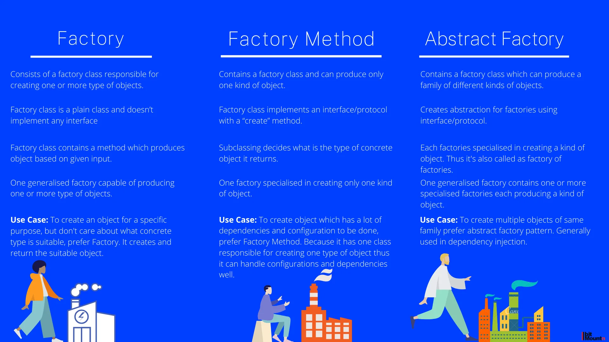

## Creational patterns

Creational design patterns are a fundamental aspect of software engineering, aimed at simplifying the creation of objects in a object oriented system. Their primary goal is to make a system independent of how its objects are created, composed, and represented.

Cons:

- Flexibility: They provide more flexibility in deciding which objects need to be created for a given case.
- Reusability: Promotes the reuse of existing code, reducing redundancy and errors.
- Decoupling: Objects are created independently of the class implementations, leading to fewer dependencies and tighter encapsulation.

### Factory

With the factory pattern we can use factory functions in order to create new objects. A function is a factory function when it returns a new object without the use of the new keyword

```
class User {
  constructor(firstName, lastName, email) {
    this.firstName = firstName;
    this.lastName = lastName;
    this.email = email;
  }

  fullName() {
    return `${this.firstName} ${this.lastName}`;
  }
}

const user1 = new User({
  firstName: "John",
  lastName: "Doe",
  email: "john@doe.com",
});

const user2 = new User({
  firstName: "Jane",
  lastName: "Doe",
  email: "jane@doe.com",
});
```

### Factory method

A Factory Method creates new objects as instructed by the client. One way to create objects in JavaScript is by invoking a constructor function with the new operator. There are situations however, where the client does not, or should not, know which one of several candidate objects to instantiate. The Factory Method allows the client to delegate object creation while still retaining control over which type to instantiate.

```
class Product {
  display() {
    console.log("Product");
  }
}

class ProductFactory {
  createProduct() {
    return new Product();
  }
}
const factory = new ProductFactory();
const product = factory.createProduct();
product.display(); // Product
```

### Abstract Factory

An Abstract Factory creates objects that are related by a common theme. In object-oriented programming a Factory is an object that creates other objects. An Abstract Factory has abstracted out a theme which is shared by the newly created objects.

```
// Abstract factory for creating UI components
class UIFactory {
  createButton() {}
  createInputField() {}
  createTooltip() {}
}

// Concrete factory for light theme components
class LightThemeFactory extends UIFactory {
  createButton() {
    return new LightThemeButton();
  }
  createInputField() {
    return new LightThemeInputField();
  }
  createTooltip() {
    return new LightThemeTooltip();
  }
}

// Concrete factory for dark theme components
class DarkThemeFactory extends UIFactory {
  createButton() {
    return new DarkThemeButton();
  }
  createInputField() {
    return new DarkThemeInputField();
  }
  createTooltip() {
    return new DarkThemeTooltip();
  }
}

// Abstract product for buttons
class Button {}

// Concrete product for light theme buttons
class LightThemeButton extends Button {
  constructor() {
    super();
    console.log('Light theme button created');
  }
}

// Concrete product for dark theme buttons
class DarkThemeButton extends Button {
  constructor() {
    super();
    console.log('Dark theme button created');
  }
}

// Usage
const lightFactory = new LightThemeFactory();
const lightButton = lightFactory.createButton(); // Output: Light theme button created

const darkFactory = new DarkThemeFactory();
const darkButton = darkFactory.createButton(); // Output: Dark theme button created
```
The Factory Method is a great tool to clean up the code and keep it simple. The Factory helps us to leverage polymorphism and be prepared for future changes. On top of the previous benefits, the Abstract Factory ensures that we are working with the set of related objects.



### Singleton

Singletons are classes which can be instantiated once, and can be accessed globally. This single instance can be shared throughout our application, which makes Singletons great for managing global state in an application.

```
let instance;
let counter = 0;

class Counter {
  constructor() {
    if (instance) {
      throw new Error("You can only create one instance!");
    }
    instance = this;
  }

  getInstance() {
    return this;
  }

  getCount() {
    return counter;
  }

  increment() {
    return ++counter;
  }

  decrement() {
    return --counter;
  }
}

const singletonCounter = Object.freeze(new Counter()); // Object.freeze is optional
export default singletonCounter;
```


### Prototype

The Prototype Pattern creates new objects, but rather than creating non-initialized objects it returns objects that are initialized with values it copied from a prototype - or example - object. The Prototype pattern is also referred to as the Properties pattern.

```
function CustomerPrototype(proto) {
    this.proto = proto;

    this.clone = function () {
        var customer = new Customer();

        customer.first = proto.first;
        customer.last = proto.last;
        customer.status = proto.status;

        return customer;
    };
}

function Customer(first, last, status) {

    this.first = first;
    this.last = last;
    this.status = status;

    this.say = function () {
        console.log("name: " + this.first + " " + this.last +
            ", status: " + this.status);
    };
}

function run() {

    var proto = new Customer("n/a", "n/a", "pending");
    var prototype = new CustomerPrototype(proto);

    var customer = prototype.clone();
    customer.say();
}
```

### Builder

Separates the construction of a complex object from its representation, allowing the same construction process to create different representations. https://medium.com/@jesusmurfontanals/builder-pattern-con-javascript-1ee3f9e2b7e9

```
class Pizza {
  constructor() {
    this.tomato = false;
    this.cheese = false;
    this.thinDough = false;
    this.pineappleSlices = 0;
    this.baconStrips = 0;
    this.otherIngredients = [];
  }
  setTomato() {
    this.tomato = true;
    return this;
  }
  setCheese() {
    this.cheese = true;
    return this;
  }
  setThinDough() {
    this.thinDough = true;
    return this;
  }


build() {
    return {
      tomato: this.tomato,
      cheese: this.cheese,
      thinDough: this.thinDough,
    };
  }
}

const pizza = new Pizza()
    .setTomato()
    .setCheese()
    .setThinDough()
    .build()
```
